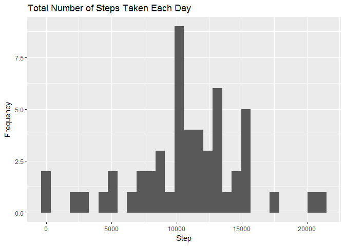
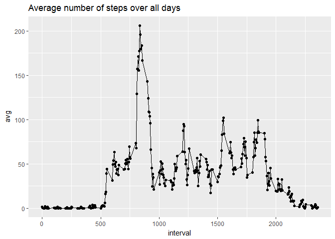
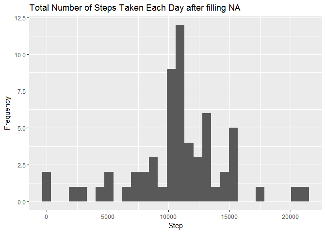
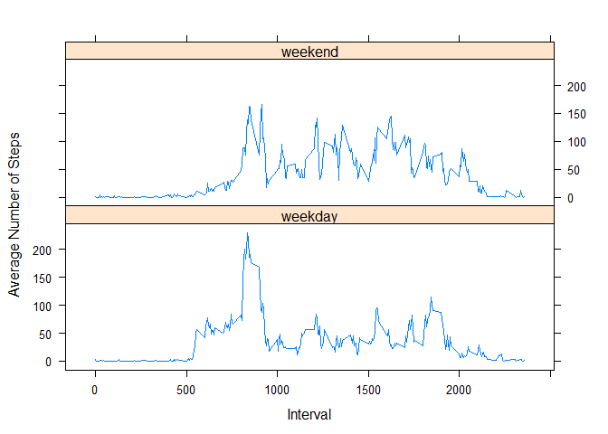

# Reproducible Research: Peer Assessment 1


## Loading and preprocessing the data

1.Load the data (i.e. read.csv())

```r
setwd("C:/MOOC/Data Science/Reproducible Research/Assignment1/RepData_PeerAssessment1")
library(dplyr)
```

```
## Warning: package 'dplyr' was built under R version 3.4.1
```

```
## 
## Attaching package: 'dplyr'
```

```
## The following objects are masked from 'package:stats':
## 
##     filter, lag
```

```
## The following objects are masked from 'package:base':
## 
##     intersect, setdiff, setequal, union
```

```r
library(ggplot2)
```

```
## Warning: package 'ggplot2' was built under R version 3.4.1
```

```r
activity_tmp <-  read.csv("activity.csv", header=T)
```

2.Process/transform the data (if necessary) into a format suitable for your analysis

```r
activity <- activity_tmp[with(activity_tmp, !is.na(steps)),]
head(activity)
```

```
##     steps       date interval
## 289     0 2012-10-02        0
## 290     0 2012-10-02        5
## 291     0 2012-10-02       10
## 292     0 2012-10-02       15
## 293     0 2012-10-02       20
## 294     0 2012-10-02       25
```


## What is mean total number of steps taken per day?
1. Make a histogram of the total number of steps taken each day

```r
by_day <- group_by(activity, date)
steps_by_day <- summarise(by_day, total = sum(steps))
steps_by_day
```

```
## # A tibble: 53 x 2
##          date total
##        <fctr> <int>
##  1 2012-10-02   126
##  2 2012-10-03 11352
##  3 2012-10-04 12116
##  4 2012-10-05 13294
##  5 2012-10-06 15420
##  6 2012-10-07 11015
##  7 2012-10-09 12811
##  8 2012-10-10  9900
##  9 2012-10-11 10304
## 10 2012-10-12 17382
## # ... with 43 more rows
```

```r
qplot(total, data = steps_by_day, xlab = "Step", ylab = "Frequency", main = "Total Number of Steps Taken Each Day")
```

```
## `stat_bin()` using `bins = 30`. Pick better value with `binwidth`.
```

<!-- -->

2. Calculate and report the mean and median total number of steps taken per day

```r
mean(steps_by_day$total)
```

```
## [1] 10766.19
```

```r
median(steps_by_day$total)
```

```
## [1] 10765
```


## What is the average daily activity pattern?
1. Make a time series plot (i.e. type = "l") of the 5-minute interval (x-axis) and the average number of steps taken, averaged across all days (y-axis)

```r
by_interval <- group_by(activity, interval)
steps_by_interval <- summarise(by_interval, avg = mean(steps))

qplot(interval, avg, data=steps_by_interval, main = "Average number of steps over all days") + geom_line()
```

<!-- -->

2. Which 5-minute interval, on average across all the days in the dataset, contains the maximum number of steps?

```r
max_steps_idx <- which.max(steps_by_interval$avg)
steps_by_interval[max_steps_idx, ]
```

```
## # A tibble: 1 x 2
##   interval      avg
##      <int>    <dbl>
## 1      835 206.1698
```

As above result shows, 835 interval contains the maximum number of steps.
## Imputing missing values
1.Calculate and report the total number of missing values in the dataset (i.e. the total number of rows with NAs)

```r
sum(is.na(activity_tmp$steps))
```

```
## [1] 2304
```

As above result shows, there are 2304 missing values in the dataset

2. Devise a strategy for filling in all of the missing values in the dataset. The strategy does not need to be sophisticated. For example, you could use the mean/median for that day, or the mean for that 5-minute interval, etc.

I filled (imputed) missing values with mean for that 5-miniute interval

3. Create a new dataset that is equal to the original dataset but with the missing data filled in.


```r
activity_imputed <- activity_tmp
NA.idx <- which(is.na(activity_tmp$steps)==1)
for(i in 1:length(NA.idx))
{
        activity_imputed$steps[NA.idx[i]] <- steps_by_interval$avg[which(steps_by_interval$interval==activity_imputed$interval[NA.idx[i]])]
}
```

4. Make a histogram of the total number of steps taken each day and Calculate and report the mean and median total number of steps taken per day. Do these values differ from the estimates from the first part of the assignment? What is the impact of imputing missing data on the estimates of the total daily number of steps?


```r
by_day_imputed <- group_by(activity_imputed, date)
steps_by_day_imputed <- summarise(by_day_imputed, total = sum(steps))

qplot(total, data = steps_by_day_imputed, xlab = "Step", ylab = "Frequency", main = "Total Number of Steps Taken Each Day after filling NA")
```

```
## `stat_bin()` using `bins = 30`. Pick better value with `binwidth`.
```

<!-- -->

```r
mean(steps_by_day_imputed$total)
```

```
## [1] 10766.19
```

```r
median(steps_by_day_imputed$total)
```

```
## [1] 10766.19
```

After filling NAs, mean was not changed, but median was slightly increased.

## Are there differences in activity patterns between weekdays and weekends?
1. Create a new factor variable in the dataset with two levels ??? “weekday” and “weekend” indicating whether a given date is a weekday or weekend day.


```r
Sys.setlocale("LC_TIME", "English") 
```

```
## [1] "English_United States.1252"
```

```r
activity_imputed$weekdays <- weekdays(as.Date(activity_imputed$date))
activity_imputed$weekdays <- ifelse(activity_imputed$weekdays %in% c("Saturday", "Sunday"), "weekend", "weekday")
```

2. Make a panel plot containing a time series plot (i.e. type = "l") of the 5-minute interval (x-axis) and the average number of steps taken, averaged across all weekday days or weekend days (y-axis). See the README file in the GitHub repository to see an example of what this plot should look like using simulated data.


```r
by_interval_imputed <- group_by(activity_imputed, interval, weekdays)
steps_by_interval_imputed <- summarise(by_interval_imputed, avg = mean(steps))

library(lattice)
xyplot(avg ~ interval | weekdays, data = steps_by_interval_imputed, layout = c(1, 2), type="l", xlab= "Interval", ylab= "Average Number of Steps")
```

<!-- -->

